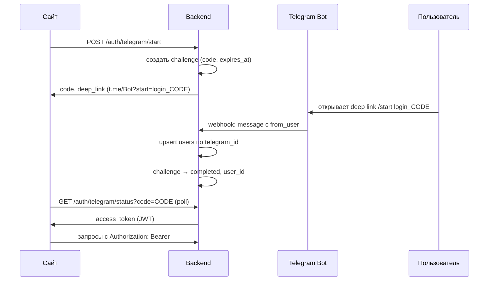
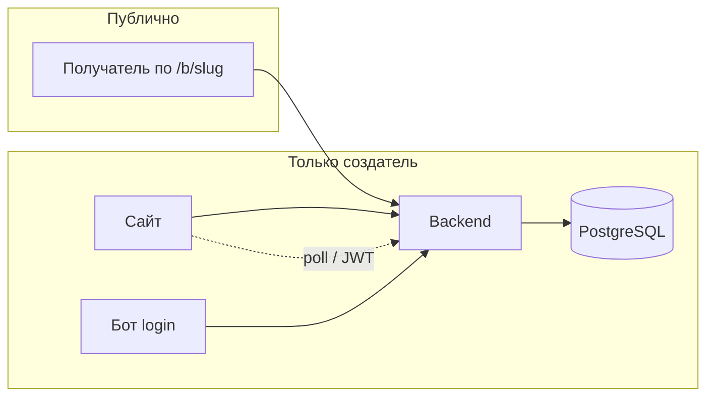

# Авторизация

## Выбранный подход

- **Telegram-бот используется только для входа** на сайт. Создание боксов, загрузка медиа и редактирование — в веб-приложении.
- **Mini App и Login Widget не используются.** Идентификация в боте опирается на то, что апдейт приходит от Telegram Bot API (webhook с секретом).
- После успешного входа backend выдаёт **собственную сессию** (JWT и при необходимости refresh через `user_sessions`).
- **Получатель подарка** открывает бокс по публичной ссылке `/b/{public_slug}` **без авторизации**.

Связанные таблицы: `users`, `telegram_login_challenges`, опционально `user_sessions` — см. [DB.md](./DB.md).

---

## Поток входа

### Шаг 1. Старт входа на сайте

Пользователь нажимает «Войти через Telegram». Frontend вызывает:

`POST /auth/telegram/start`

Backend:

1. Генерирует криптостойкий одноразовый `code`.
2. Создаёт запись в `telegram_login_challenges` со `status = pending` и `expires_at` (рекомендуется 5–10 минут).
3. Возвращает клиенту:
   - `code` (для polling);
   - `bot_url` — `https://t.me/<bot_username>?start=login_<code>`.

На странице показывают ссылку или QR-код.

### Шаг 2. Подтверждение в боте

Пользователь переходит по ссылке. Telegram отправляет webhook с командой `/start login_<code>`.

Backend (обработчик webhook):

1. Проверяет, что запрос действительно от Telegram (секрет webhook, HTTPS).
2. Извлекает `code` из параметра `start` (префикс `login_`).
3. Находит challenge: `status = pending`, `expires_at > now()`, `code` совпадает.
4. Берёт `telegram_id` и профиль из `message.from_user` (`id`, `username`, `first_name`, `last_name`, `language_code`).
5. Выполняет **upsert** в `users` по `telegram_id`, обновляет `last_seen_at`.
6. Обновляет challenge: `status = completed`, `telegram_id`, `user_id`, `completed_at`.
7. Опционально отправляет сообщение в чат: «Вход выполнен, вернитесь на сайт».

Если код невалиден или истёк — ответ пользователю в боте с просьбой начать вход заново на сайте.

### Шаг 3. Получение токена на сайте

Frontend опрашивает:

`GET /auth/telegram/status?code=<code>`

Ответы:

- `pending` — ждать.
- `expired` — предложить начать снова.
- `completed` — выдать `access_token` (и при необходимости `refresh_token`).

**Альтернатива polling:** редирект на `https://site/auth/callback?code=...` после шага в боте (одноразовый код, короткий TTL).

### Шаг 4. Дальнейшие запросы

Все защищённые эндпоинты принимают:

`Authorization: Bearer <access_token>`

В JWT рекомендуется хранить внутренний `user_id` (`users.id`, UUID), не полагаться только на `telegram_id` с клиента.

Logout (если есть `user_sessions`): отзыв refresh-токена (`revoked_at`).

---

## Что делает бот (минимум)

| Сценарий | Поведение |
|----------|-----------|
| `/start login_<code>` | Подтверждение входа (основной сценарий) |
| `/start` без аргумента | Подсказка: войти через кнопку на сайте |
| После успешного login | Опционально: «Готово, вернитесь на сайт» |

Бот **не** принимает медиа, не создаёт боксы и не управляет контентом.

---

## Безопасность

| Требование | Реализация |
|------------|------------|
| Подлинность апдейтов | Webhook Telegram + `secret_token` в URL заголовке |
| Одноразовость входа | `code` → `completed`, повторное использование запрещено |
| Срок жизни кода | `expires_at`, статус `expired` |
| Сложность кода | Криптостойкая случайная строка (≥ 32 байт энтропии в base64url) |
| Нельзя подделать telegram_id | API не принимает `telegram_id` от клиента без завершённого challenge |
| Rate limit | На `POST /auth/telegram/start` и `GET .../status` по IP |
| Секреты | Bot token только в env, не в репозитории |
| Публичный бокс | Отдельно от auth; slug не угадываемый (nanoid / длинный random) |

**Не хранить:** сырой bot token в БД; `initData` Mini App (не используется).

---

## Эндпоинты (контракт)

| Метод | Путь | Auth | Описание |
|-------|------|------|----------|
| `POST` | `/auth/telegram/start` | Нет | Создать challenge |
| `GET` | `/auth/telegram/status` | Нет | Poll по `code` |
| `POST` | `/telegram/webhook` | Секрет Telegram | Входящие апдейты бота |
| `POST` | `/auth/logout` | JWT | Опционально, отзыв сессии |

Защищённые маршруты (боксы, загрузка файлов) — только с валидным JWT.

---

## Отличие от других способов Telegram (не выбраны)

| Способ | Почему не используем |
|--------|----------------------|
| Mini App `initData` | Не нужен отдельный UI в Telegram |
| Login Widget | Вход сознательно через бота по deep link |
| Передача `telegram_id` с фронта | Небезопасно без подписи Telegram |

---

## Диаграмма компонентов

