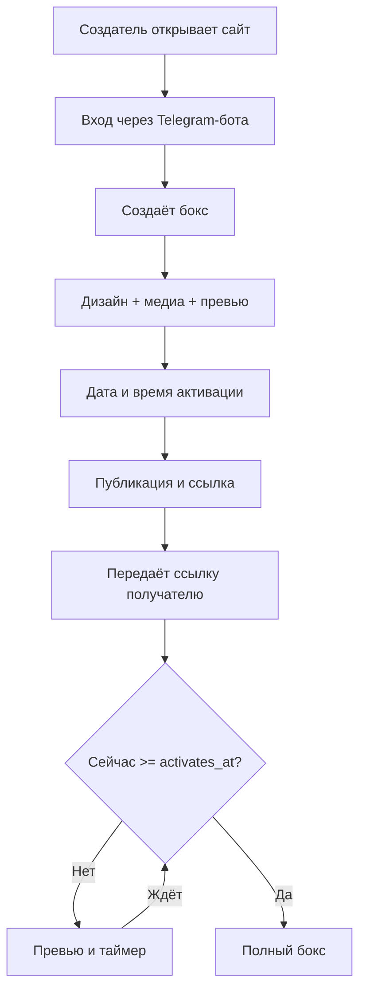

# Основной сценарий использования

## Продукт

**Pixelgift** — веб-приложение для создания виртуального подарочного бокса второй половинке.

Создатель наполняет бокс медиа (фото, гифки, видео, голосовые), выбирает дизайн и задаёт дату и время открытия. Получатель открывает уникальную ссылку: до активации видит только превью и таймер, после — полный контент.

Авторизация создателя — через Telegram-бота (только вход). Подробности — в [AUTH.md](./AUTH.md). Схема данных — в [DB.md](./DB.md).

---

## Акторы

| Актор | Кто |
|-------|-----|
| **Создатель** | Пользователь, который собирает и публикует бокс (нужен вход через Telegram) |
| **Получатель** | Человек по публичной ссылке (без аккаунта и без Telegram) |
| **Система** | Backend, сайт, Telegram-бот (только login) |

---

## UC-1. Создать и отправить виртуальный бокс (основной)

### Цель

Создатель готовит бокс к нужной дате и передаёт получателю ссылку.

### Предусловия

- Создатель может открыть сайт.
- Есть доступ к Telegram для входа.
- В каталоге есть хотя бы один активный дизайн (`box_designs`).

### Основной поток

1. **Вход**  
   Создатель нажимает «Войти через Telegram», подтверждает вход в боте по deep link, сайт получает JWT. (Детали — [AUTH.md](./AUTH.md).)

2. **Создание бокса**  
   Создатель начинает новый бокс (черновик, `status = draft`).

3. **Выбор дизайна**  
   Выбирает оформление из каталога (`design_id`).

4. **Наполнение**  
   Загружает медиа (картинки, гифки, видео, голосовые), расставляет порядок, при необходимости добавляет подписи и текст письма (`message`).

5. **Превью до открытия**  
   Задаёт, что увидит получатель до активации: `preview_title`, `preview_image_url` (и при необходимости заголовок `title`).

6. **Дата активации**  
   Указывает `activates_at` и часовой пояс (`timezone`). Момент активации должен быть в будущем.

7. **Публикация**  
   Создатель публикует бокс (`status = scheduled`). Система выдаёт уникальную ссылку `/b/{public_slug}`.

8. **Передача ссылки**  
   Создатель копирует ссылку и отправляет получателю любым способом (мессенджер, соцсети и т.д.).

9. **Ожидание**  
   До `activates_at` по ссылке доступны только превью и обратный отсчёт. Полный контент (`message`, `box_items`) не отдаётся.

10. **Открытие**  
    После `activates_at` получатель (или при повторном заходе) видит полный бокс в выбранном дизайне. Система может зафиксировать `first_opened_at` и перевести статус в `active`.

### Результат

- У создателя есть опубликованный бокс со ссылкой.
- Получатель может открыть подарок в нужный момент без регистрации.

### Альтернативы и исключения

| # | Условие | Поведение |
|---|---------|-----------|
| A1 | Код входа истёк / не подтверждён в боте | Создатель начинает вход заново на сайте |
| A2 | Черновик не опубликован | Публичная ссылка недоступна или ведёт на «не опубликовано» |
| A3 | Создатель меняет бокс до активации | Разрешено редактирование (дизайн, медиа, дата, превью) в рамках правил продукта |
| A4 | `activates_at` уже в прошлом при сохранении | Ошибка валидации; дату нужно задать в будущем |
| A5 | Нет медиа / не выбран дизайн при публикации | Ошибка: публикация невозможна (минимальные требования продукта) |
| A6 | Боткс архивирован | Ссылка не показывает контент (или показывает «подарок недоступен») |

---

## UC-2. Открыть бокс по ссылке (получатель)

### Цель

Получатель смотрит подарок по ссылке от создателя.

### Предусловия

- Есть валидный `public_slug`.
- Бокс опубликован (`scheduled` или `active`), не архивирован.

### Основной поток

1. Получатель открывает `/b/{public_slug}` в браузере (без входа).
2. **Если сейчас < `activates_at`:** показывается превью, таймер, без содержимого бокса.
3. **Если сейчас ≥ `activates_at`:** показывается полный бокс (дизайн, письмо, медиа по порядку).
4. При первом успешном просмотре полного контента система может записать `first_opened_at`.

### Результат

Получатель видит превью или полный подарок в зависимости от времени.

---

## UC-3. Управление своими боксами (создатель)

### Цель

Создатель видит и правит свои боксы после входа.

### Основной поток

1. Создатель авторизован (JWT).
2. Открывает список «Мои боксы».
3. Может открыть черновик или опубликованный бокс, изменить содержимое (пока правила продукта это позволяют), скопировать ссылку, архивировать.

### Ограничения

- Редактировать можно только свои боксы (`owner_id`).
- После активации продукт может ограничить правки (например, только архивация) — уточняется при реализации.

---

## Диаграмма основного сценария

---

## Границы MVP

В основном сценарии **есть**:

- вход через бота;
- создание бокса с дизайном и медиа;
- отложенная активация и публичная ссылка;
- просмотр превью / полного контента без аккаунта у получателя.

**Вне основного сценария (пока не обязательно):**

- реакции получателя, уведомления создателю в боте;
- оплата / платные дизайны;
- аналитика просмотров;
- Mini App / Login Widget.
