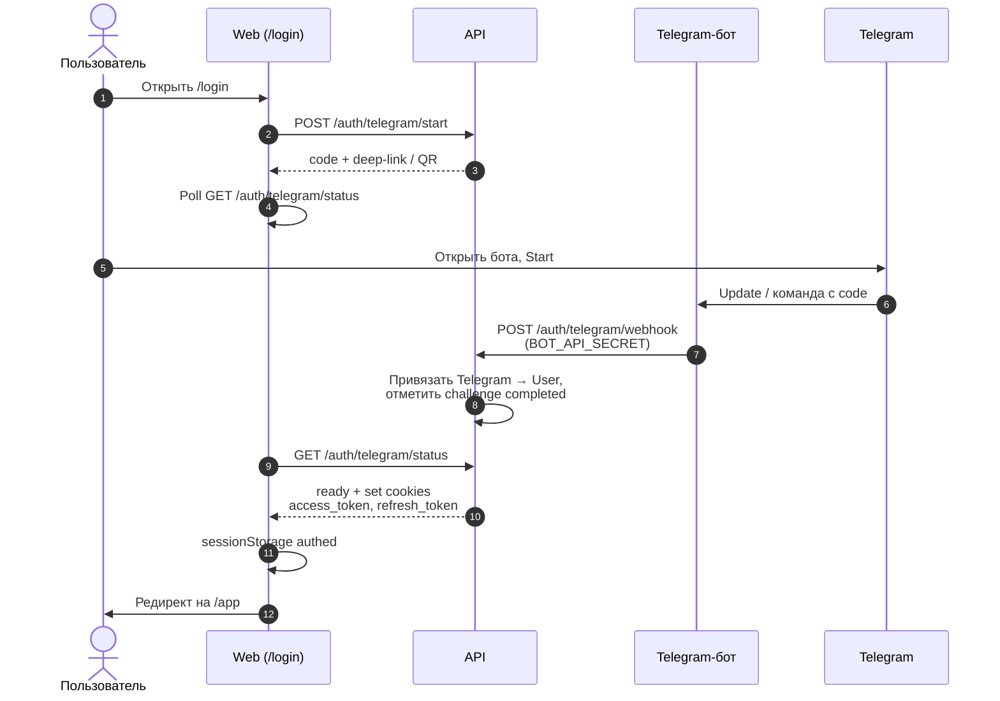
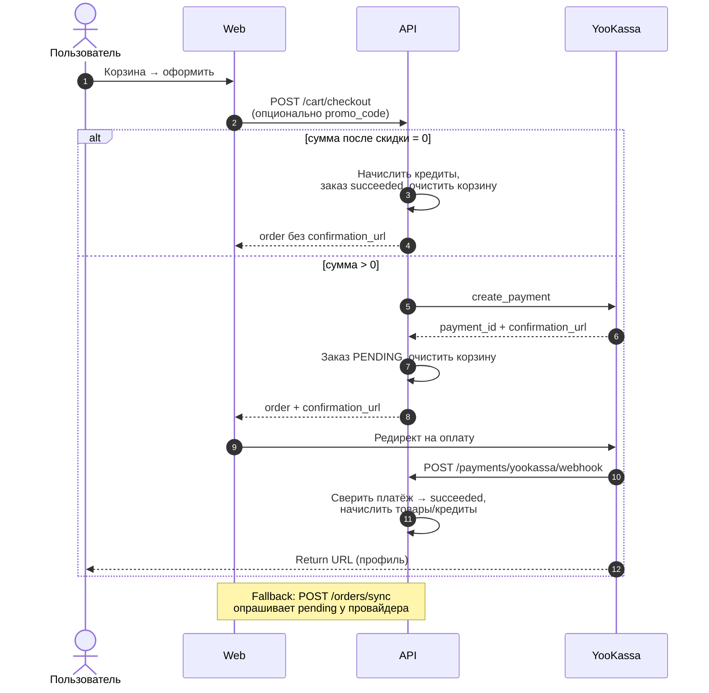
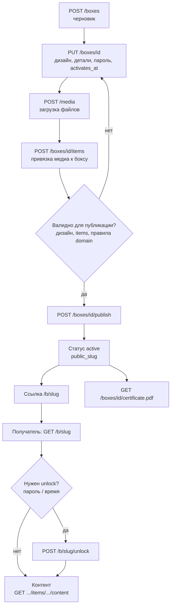

# Потоки

Ключевые сценарии backend + фронт. Подробные сигнатуры — в [карте API](http-api.md) и OpenAPI.

## Логин через Telegram

Кратко: браузер только создаёт challenge и ждёт; **завершает** логин бот через защищённый webhook.

## Checkout и webhook YooKassa

Webhook — основной путь подтверждения; `/orders/sync` — страховка, если webhook задержался.

## Публикация бокса

Владелец правит бокс только до/в рамках правил `BoxNotEditableError`; после publish получатель ходит только в **public**-эндпоинты.
